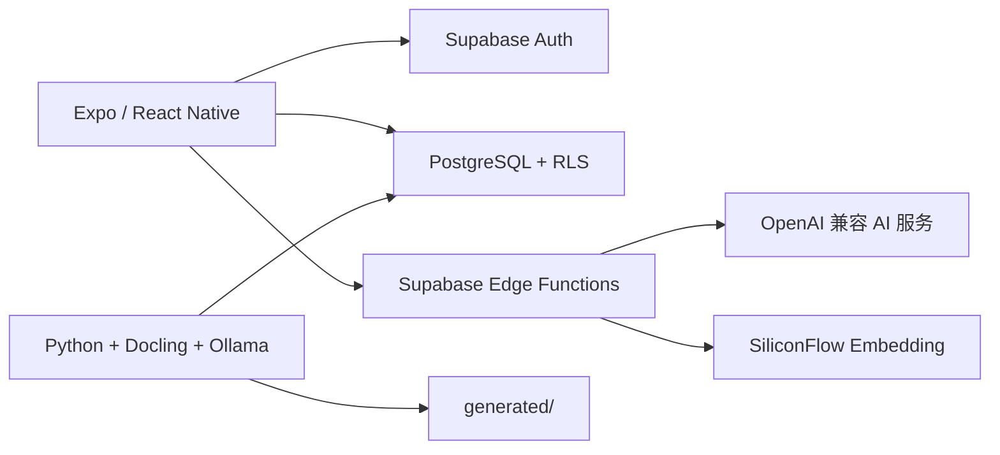

# Medlearn

Medlearn 是一个面向医学生与低年资住院医师的临床推理训练应用。当前产品主线是病例训练 MVP：

```text
选择主诉
  -> 问诊、查体与检查
  -> 提交诊断、鉴别诊断、证据和治疗
  -> 服务端确定性评分
  -> 针对薄弱点复盘并重做
```

> Medlearn 仅用于医学教育，不提供真实患者的诊断或治疗建议。请勿输入任何可识别的真实患者信息。

## 项目状态

审查基线：2026-06-13。

项目已完成病例训练主链路的工程实现，本地 `npm run check` 已通过，但 **远端 Supabase 部署与真机 E2E 仍是 Alpha 发布前的唯一阻塞项**。

| 项目 | 当前结果 |
|---|---|
| Node 回归测试 | 35/35 通过 |
| Python 治理/管线测试 | 18/18 通过 |
| 依赖树 | `npm ls --depth=0` 通过 |
| TypeScript | 通过 |
| ESLint | 通过 |
| 病例种子库 | 15 个 approved demo 病例（`supabase/seeds/002_alpha_case_library.sql`） |
| 知识数据模型 | 已统一到 `knowledge_nodes` |
| 服务端病例审核强制 | `case-patient` / `case-submit` / `case-abandon` 已校验 |
| AI proxy 成本控制 | 迁移 019 + 用户配额与用量记录 |
| 远端 Supabase | 待凭据与部署验证（`remote_supabase_validation`） |
| iOS/Android E2E | 尚未完成 |

### 已实现

- Supabase 邮箱认证与用户会话
- 病例模板、病例会话和消息记录
- 问诊、结构化查体、检查、诊断和治疗流程
- `case-submit` 服务端确定性评分
- 诊断同义词、鉴别诊断、证据覆盖和危险治疗扣分
- AI 患者提示注入、诊断泄漏和危险建议检测
- 病例提示次数、单病例 token 和成本上限
- 医学免责声明、内容问题报告和评分申诉
- 学习事件、病例完成记录和针对性重做
- Python 教材目录解析、知识抽取和 Supabase 上传管线

### 当前发布阻塞

1. 远端 Supabase 项目需应用迁移 001–019、部署 Edge Functions，并完成真机端到端验收。
2. Demo 病例库使用 `alpha-demo-medical-reviewer` 占位审核人；生产发布前需替换为真实医学审核签字记录。
3. Windows + Node 24 + Expo 56 的 web export 可能 OOM；本地验证建议使用 Node 22.13.1。

详细产品范围见 [MVP PRD](docs/MVP_PRD.md)，此前进度记录见 [项目状态](docs/PROJECT_STATUS.md)。

## MVP 范围

当前默认导航聚焦：

- 登录和注册
- 首页学习记录
- 病例选择与训练
- 病例评分、反馈和重做
- 个人中心

以下模块仍保留在代码库中，但属于隐藏、实验或非 MVP 功能：

- 费曼复述
- 知识地图和学习路径
- 模拟考试
- 独立 AI 问答
- 知识搜索与 V5 知识详情
- RAG 教材评估

## 技术架构



| 层级 | 技术 |
|---|---|
| 客户端 | Expo SDK 56、React Native 0.85、React 19、TypeScript 6 |
| 路由 | Expo Router |
| 数据请求 | TanStack Query、Supabase JS |
| 本地会话 | AsyncStorage |
| 后端 | Supabase Auth、PostgreSQL、RLS、Edge Functions |
| 向量检索 | pgvector，1024 维 |
| AI | OpenAI 兼容接口，经 Edge Function 代理 |
| 教材管线 | Python 3.11、PyMuPDF、Docling、Ollama |
| 测试 | Node Test Runner、Python unittest |

## 目录结构

```text
app/                    Expo Router 页面
components/             通用 UI 组件
constants/              主题和病例流程常量
hooks/                  Auth、React Query 和业务 Hooks
lib/                    主 Supabase 客户端
services/               客户端业务服务
shared/                 客户端与 Edge Functions 共用的纯逻辑
supabase/functions/     Edge Functions
supabase/migrations/    001-018 数据库迁移
supabase/seeds/         病例种子数据
scripts/                教材抽取、评估和入库管线
tests/                  Node 与 Python 回归测试
docs/                   产品、设计、架构和部署文档
generated/              本地管线输出，默认不提交
textbook/               本地教材源文件，默认不提交
```

## 开发环境

建议准备：

- Node.js 20 或更新版本
- npm
- Python 3.11 或更新版本，仅教材管线需要
- Supabase 项目
- Supabase CLI，进行本地数据库和函数开发时需要
- Ollama，运行本地教材抽取或本地 embedding 时需要

本次审查使用 Node.js 24.16、npm 11.13、Python 3.11.15、Expo CLI 56.1 和 Ollama 0.30。

## 本地配置

### 1. 安装依赖

```bash
npm install
```

### 2. 创建环境文件

PowerShell：

```powershell
Copy-Item .env.example .env
```

macOS/Linux：

```bash
cp .env.example .env
```

客户端最小配置：

```dotenv
EXPO_PUBLIC_SUPABASE_URL=https://your-project.supabase.co
EXPO_PUBLIC_SUPABASE_ANON_KEY=your-anon-key
```

不要把 `SUPABASE_SERVICE_ROLE_KEY`、`AI_API_KEY` 或 `SILICONFLOW_KEY` 添加 `EXPO_PUBLIC_` 前缀。带此前缀的变量会进入客户端包。

### 3. 启动应用

```bash
npm start
```

也可以使用：

```bash
npm run android
npm run ios
npm run web
```

当前 checkout 会被“当前发布阻塞”中的实验性知识页阻断打包。修复这些导入和路由后，再以 `npm run check` 与 Expo 导出作为可交付标准。

## 环境变量

### 客户端

| 变量 | 必需 | 说明 |
|---|---:|---|
| `EXPO_PUBLIC_SUPABASE_URL` | 是 | Supabase 项目 URL |
| `EXPO_PUBLIC_SUPABASE_ANON_KEY` | 是 | Supabase anon key |
| `EXPO_PUBLIC_EMBEDDING_PROVIDER` | 否 | `ollama` 使用客户端直连；其他值使用 `embedding-proxy` |
| `EXPO_PUBLIC_OLLAMA_URL` | 否 | 本地 Ollama 地址，仅适合本机开发 |
| `EXPO_PUBLIC_OLLAMA_EMBED_MODEL` | 否 | 默认 `bge-m3` |

移动设备中的 `127.0.0.1` 指向设备自身。真机和生产环境不应默认使用客户端直连 Ollama，应改用可访问的安全代理。

### Edge Functions

| 变量 | 使用位置 |
|---|---|
| `AI_API_KEY` | `ai-proxy`、`case-patient` |
| `AI_BASE_URL` | OpenAI 兼容接口地址 |
| `AI_MODEL` | AI 模型名 |
| `AI_INPUT_COST_PER_MILLION` | 患者模拟输入成本估算 |
| `AI_OUTPUT_COST_PER_MILLION` | 患者模拟输出成本估算 |
| `CASE_MAX_TOKENS` | 单病例 token 上限 |
| `CASE_MAX_COST_USD` | 单病例成本上限 |
| `SILICONFLOW_KEY` | `embedding-proxy` |

Supabase 会向已部署函数提供项目 URL、anon key 和 service role key。业务密钥应通过 Supabase secrets 配置，不应写入仓库。

### Python 管线

| 变量 | 说明 |
|---|---|
| `SUPABASE_URL` | 上传目标 |
| `SUPABASE_SERVICE_ROLE_KEY` | 管线写入权限 |
| `OLLAMA_URL` | 默认 `http://127.0.0.1:11434` |
| `OLLAMA_MODEL` | Pipeline v3 默认 `medlearn-qwen3:8b` |
| `OLLAMA_EMBED_MODEL` | 默认 `bge-m3` |
| `MODEL_PATH` | 本地 embedding 模型路径或名称 |
| `USE_LOCAL_MODEL` | 是否使用本地 embedding |
| `SILICONFLOW_KEY` | 可选远端 embedding |

## Supabase 初始化

本地环境可使用：

```bash
supabase start
supabase db reset
```

`supabase/config.toml` 会按顺序应用 `supabase/migrations/001-018`，并执行 `supabase/seeds/*.sql`。

远端项目在完成 `supabase link` 后可执行：

```bash
supabase db push
supabase functions deploy ai-proxy
supabase functions deploy embedding-proxy
supabase functions deploy case-submit
supabase functions deploy case-patient
supabase functions deploy case-abandon
```

至少配置：

```bash
supabase secrets set AI_API_KEY=...
supabase secrets set AI_BASE_URL=...
supabase secrets set AI_MODEL=...
supabase secrets set SILICONFLOW_KEY=...
supabase secrets set AI_INPUT_COST_PER_MILLION=...
supabase secrets set AI_OUTPUT_COST_PER_MILLION=...
```

病例种子不会自动成为可发布病例。迁移 `017_case_review_workflow.sql` 要求 `approved` 病例同时包含 `reviewed_by` 和 `reviewed_at`。只有具备资质的医学审核者完成审核后，才能更新这些字段。

检查远端病例库发布门槛：

```bash
npm run validate:cases
```

该命令需要 `.env` 中的 `SUPABASE_URL` 和 `SUPABASE_SERVICE_ROLE_KEY`，并要求至少 15 个已批准病例。

## 教材抽取管线

### 1. 安装 Python 依赖

```bash
python -m venv .venv-pipeline
```

PowerShell：

```powershell
.\.venv-pipeline\Scripts\Activate.ps1
pip install -r scripts\requirements.txt
```

macOS/Linux：

```bash
source .venv-pipeline/bin/activate
pip install -r scripts/requirements.txt
```

### 2. 准备 Ollama 模型

`scripts/Modelfile.medlearn-qwen3` 的 `FROM` 当前指向开发机上的绝对 GGUF 路径。首次使用前需要改成自己的模型路径，然后执行：

```bash
ollama create medlearn-qwen3:8b -f scripts/Modelfile.medlearn-qwen3
```

### 3. 先校验目录

```bash
python scripts/pipeline_v3_extract.py "textbook/内科学（第10版）.pdf" --catalog-only
```

### 4. 小规模试运行

```bash
python scripts/pipeline_v3_extract.py "textbook/内科学（第10版）.pdf" --section-limit 1 --limit 5
```

### 5. 完整处理与上传

```bash
python scripts/pipeline_v3_extract.py "textbook/内科学（第10版）.pdf"
python scripts/pipeline_v3_extract.py "textbook/内科学（第10版）.pdf" --upload
```

默认输出位于 `generated/pipeline_v3/`。上传前应先检查 catalog report、map preview 和 quality report。

## 验证命令

```bash
npm run typecheck
npm run lint
npm test
npm run check
python -m unittest tests/test_pipeline_v3_catalog.py
npx expo export --platform web
```

依赖安全审计需要网络：

```bash
npm audit --omit=dev
```

## 安全与医学审核

- 客户端不得读取 `ground_truth` 和 `scoring_rubric`。
- 最终评分只能由 `case-submit` 使用服务端数据计算。
- 客户端不得写入最终分数、完成状态、token 或成本。
- AI 患者输出必须经过诊断泄漏和危险建议检测。
- 所有生产 Edge Functions 必须进行用户级限流和成本监控。
- 服务端函数必须独立校验病例处于 `approved` 且启用状态，不能只依赖客户端查询或 RLS。
- 医学测试通过不等于医学审核通过。
- 模型、提示词或评分规则变更后，应重新运行全部病例回归测试并进行人工抽样。

## 文档索引

- [项目宪法](docs/PROJECT_CONSTITUTION.md)：稳定的产品身份、决策优先级和协作规则
- [当前状态](docs/CURRENT_STATE.md)：由 `state/*.yaml` 自动生成，禁止手写
- [ADR 索引](docs/ADR_INDEX.yaml)：按适用范围检索架构决策
- [MVP PRD](docs/MVP_PRD.md)：当前产品范围和发布门槛
- [项目状态](docs/PROJECT_STATUS.md)：2026-06-11 的阶段记录
- [学习设计原则](docs/LEARNING_DESIGN_PRINCIPLES.md)
- [API 文档](docs/API.md)
- [技术架构](docs/TECHNICAL_ARCHITECTURE.md)
- [PDF 提取指南](docs/PDF_EXTRACTION_GUIDE.md)
- [RAG 配置指南](docs/RAG_SETUP_GUIDE.md)
- [邮件 OTP 配置](docs/EMAIL_OTP_SETUP.md)

部分历史文档仍包含早期“大而全平台”或 Taro/Capacitor 设计。发生冲突时，以 `docs/MVP_PRD.md`、编号迁移和当前代码为准。

项目状态变更后必须依次执行：

```bash
python scripts/validate_project_state.py
python scripts/generate_current_state.py
python scripts/generate_current_state.py --check
```

## 许可证

仓库当前未包含 `LICENSE` 文件。对外发布、复制或分发前，应先明确许可证和第三方教材内容的授权边界。
